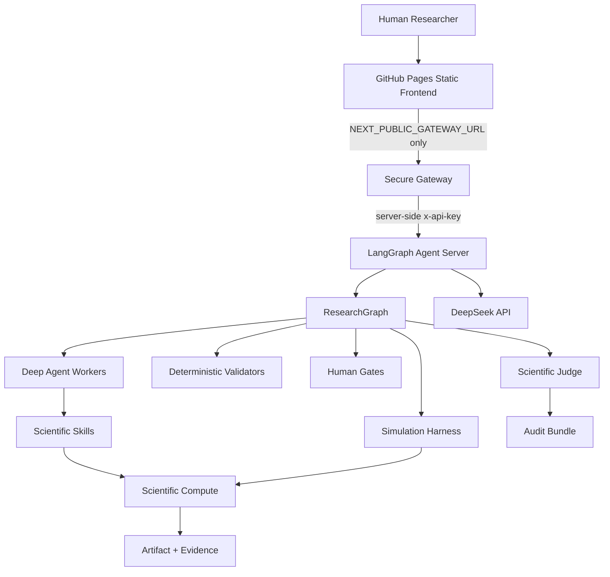
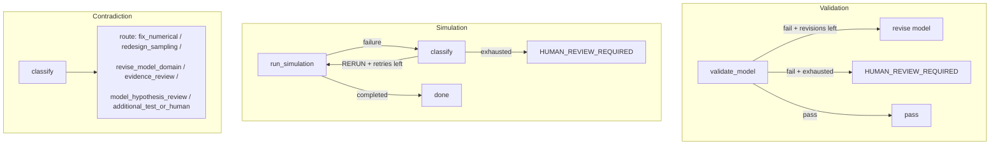

# ARCHITECTURE.md — STOV AI Scientist

## System architecture

Layer responsibilities (spec §2):

| Layer | Responsibility |
|---|---|
| LangGraph | Scientific Control Plane — decides when to call which worker |
| Deep Agents | bounded long-horizon research workers (literature, hypothesis, mechanism, counterexample, synthesis) |
| Scientific Skills | capabilities (K-Dense upstream skills + stov-* domain skills) |
| Pydantic | scientific contracts (schemas/) |
| SymPy / Pint / NumPy / SciPy | deterministic validation + compute |
| LangSmith | tracing + evaluation + deployment |
| GitHub Pages | STATIC web frontend ONLY — no secrets, ever |
| Gateway | secure browser/backend boundary (secret holder) |
| DeepSeek | LLM provider (DEEPSEEK_API_KEY only) |

## ResearchGraph

Human gates: SCOPE, HYPOTHESIS_DIRECTION, FINAL_CLAIM — LangGraph
`interrupt()` with APPROVE / EDIT / REJECT + resume.

## ValidationGraph / SimulationGraph / ContradictionGraph

## Scientific integrity architecture

- LLM output lands in Pydantic contracts before entering any graph edge.
- Validator order: Schema → Units → Dimensions → Symbols → Limits →
  Boundary → Topology → Sampling → Physics.
- All loops bounded by AcceptancePolicy; exceeding a bound →
  HUMAN_REVIEW_REQUIRED.
- Numerical failure ≠ physical contradiction; search failure ≠
  "no literature exists"; INCONCLUSIVE is a valid outcome.
- Every claim traces: Claim → Evidence → Model → Simulation → Parameters →
  Code → Git Commit → Environment (audit bundle + SHA256 artifacts).
